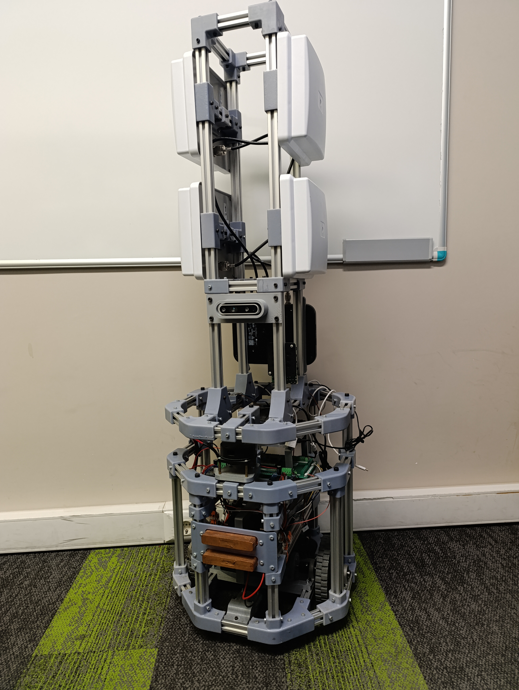

# ROS-2-Based-Autonomous-Mobile-Robot

Developed an autonomous mobile robot as part of a TÜBİTAK 1507 Project, combining expertise in mechanical, electrical, and software engineering.
Designed and manufactured the robot's chassis and structural components, integrated critical hardware like LIDAR, IMU, encoders, and power systems, and implemented ROS 2 for navigation and control.
Developed real-time embedded software using MicroROS and STM32, focusing on precise motor control and data acquisition. 
Additionally, I developed the simulation of the robot using ROS 2, Gazebo, and MATLAB & Simulink tools.
